# AI Logistics Control Tower - Eraser Architecture Diagram

Paste the following into Eraser as a Mermaid diagram.

```mermaid
flowchart LR
    %% Styles
    classDef source fill:#10243f,stroke:#35b7ff,color:#ecf7ff,stroke-width:1px;
    classDef stream fill:#0c1c31,stroke:#75f3ff,color:#ecf7ff,stroke-width:1px;
    classDef agent fill:#1b1c10,stroke:#f5cf5a,color:#fff6cf,stroke-width:1px;
    classDef data fill:#10261d,stroke:#46e0a1,color:#e8fff4,stroke-width:1px;
    classDef decision fill:#1d1535,stroke:#8e7dff,color:#f0ecff,stroke-width:1px;
    classDef human fill:#2a1f11,stroke:#f5cf5a,color:#fff4df,stroke-width:1px;
    classDef exec fill:#10261d,stroke:#46e0a1,color:#e8fff4,stroke-width:1px;
    classDef obs fill:#122033,stroke:#75f3ff,color:#ecf7ff,stroke-width:1px;
    classDef gov fill:#1d1722,stroke:#ff8ba0,color:#fff0f4,stroke-width:1px;
    classDef fail fill:#2a1318,stroke:#ff6177,color:#ffe5ea,stroke-width:1px;

    subgraph L1[Event Sources Layer]
        OMS[Order Management System]
        WMS[Warehouse Management System]
        TMS[Transport Management System]
        IOT[IoT Devices<br/>GPS / Scanners]
        API[External APIs]
    end

    subgraph L2[Event Streaming / Messaging Layer]
        BUS[Kafka / PubSub Event Bus]
        TOP1[shipment_events]
        TOP2[tracking_updates]
        TOP3[exceptions]
    end

    subgraph L3[AI Orchestration Layer]
        DET[Detection Agent<br/>Detects delay / anomaly]
        DIA[Diagnosis Agent<br/>Finds root cause]
        DEC[Decision Agent<br/>Suggests actions]
        RISK[Risk & Compliance Agent<br/>Validates policy]
        AUD[Audit Agent<br/>Logs reasoning]
    end

    subgraph L4[Knowledge & Context Layer]
        HIST[Historical Shipment Data]
        SLA[SLA Rules]
        HUB[Hub Capacity]
        DRIVER[Driver Performance]
        CTX[Context / Policy Store]
    end

    subgraph L5[Decision Engine]
        SCORE[Confidence Score]
        GATE{Confidence >= Threshold<br/>and Approval Not Required?}
    end

    subgraph L6[Human In The Loop]
        HUMAN[Operations Manager]
        APPROVE[Approve / Reject]
    end

    subgraph L7[Execution Layer]
        ACT1[Reassign Vehicle]
        ACT2[Notify Customer]
        ACT3[Escalate To Hub]
        SYS[Connected Enterprise Systems]
    end

    subgraph L8[Observability & Monitoring]
        METRIC1[Event Throughput]
        METRIC2[Decision Latency]
        METRIC3[Failure Rate]
        DASH[Monitoring Dashboard]
    end

    subgraph L9[Governance & Audit]
        LEDGER[Decision Ledger]
        WHY[Why Decision Was Made]
        WHO[Which Agent Contributed]
        COMP[Compliance Record]
    end

    subgraph L10[Failure Handling & Retry]
        TIMEOUT[Agent Timeout]
        APIFAIL[API Failure]
        LOWCONF[Low Confidence Decision]
        RETRY[Retry Orchestration Loop]
        DLQ[Dead Letter Queue]
    end

    OMS --> BUS
    WMS --> BUS
    TMS --> BUS
    IOT --> BUS
    API --> BUS

    BUS --> TOP1
    BUS --> TOP2
    BUS --> TOP3
    TOP3 --> DET

    DET --> DIA
    DIA --> DEC
    DEC --> RISK
    RISK --> AUD

    HIST --> CTX
    SLA --> CTX
    HUB --> CTX
    DRIVER --> CTX

    CTX --> DET
    CTX --> DIA
    CTX --> DEC
    CTX --> RISK

    DEC --> SCORE
    RISK --> SCORE
    SCORE --> GATE

    GATE -- Yes --> ACT1
    GATE -- Yes --> ACT2
    GATE -- Yes --> ACT3

    GATE -- No --> HUMAN
    HUMAN --> APPROVE
    APPROVE --> ACT1
    APPROVE --> ACT2
    APPROVE --> ACT3

    ACT1 --> SYS
    ACT2 --> SYS
    ACT3 --> SYS

    DET --> LEDGER
    DIA --> LEDGER
    DEC --> LEDGER
    RISK --> LEDGER
    AUD --> LEDGER
    SYS --> LEDGER
    LEDGER --> WHY
    LEDGER --> WHO
    LEDGER --> COMP

    BUS --> METRIC1
    SCORE --> METRIC2
    RETRY --> METRIC3
    METRIC1 --> DASH
    METRIC2 --> DASH
    METRIC3 --> DASH

    TIMEOUT --> RETRY
    APIFAIL --> RETRY
    LOWCONF --> RETRY
    RETRY --> DET
    RETRY --> DLQ
    DLQ --> LEDGER

    class OMS,WMS,TMS,IOT,API source;
    class BUS,TOP1,TOP2,TOP3 stream;
    class DET,DIA,DEC,RISK,AUD agent;
    class HIST,SLA,HUB,DRIVER,CTX data;
    class SCORE,GATE decision;
    class HUMAN,APPROVE human;
    class ACT1,ACT2,ACT3,SYS exec;
    class METRIC1,METRIC2,METRIC3,DASH obs;
    class LEDGER,WHY,WHO,COMP gov;
    class TIMEOUT,APIFAIL,LOWCONF,RETRY,DLQ fail;
```

## Notes

- The diagram is structured to match the HTML animation system.
- The `No` branch on the decision gate represents either `confidence < threshold` or `requiresApproval = true`.
- The retry loop and dead-letter queue preserve reliability and auditability.
