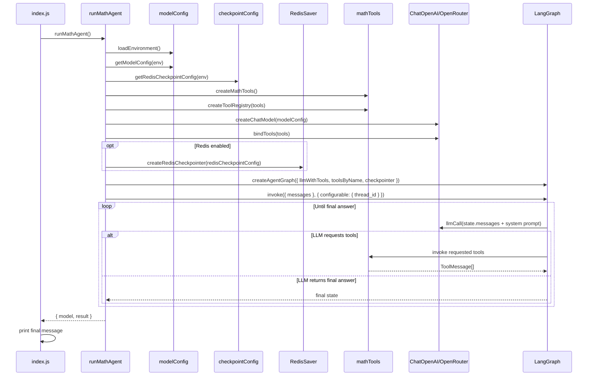

# Low-Level Design: `langgraph-test`

## Overview

`langgraph-test` is a small arithmetic agent implemented with `LangGraph` for control flow and `LangChain` primitives for model and tool integration. The application accepts a natural-language math question, lets the model decide whether to call arithmetic tools, executes those tools, and loops until the model produces a final answer.

The current design follows a composition-root pattern:

- `index.js` is the entrypoint.
- `src/app` orchestrates the use case.
- `src/config` manages constants and environment-backed model selection.
- `src/llm` creates the chat model.
- `src/tools` defines the arithmetic tools and tool registry.
- `src/graph` builds the LangGraph state machine.

## Goals

- Keep runtime orchestration simple and explicit.
- Separate concerns across small modules.
- Support OpenRouter-backed model execution.
- Support tool-calling math workflows.
- Support optional Redis-backed checkpoint persistence for LangGraph threads.
- Make the system easy to extend with additional tools or different models.

## Non-Goals

- Long-term semantic memory beyond LangGraph checkpoint persistence.
- Streaming responses.
- Production-grade observability, retries, or rate-limit handling.
- Multi-agent coordination.
- Rich input validation for end-user prompts.

## High-Level Runtime Flow

1. `index.js` starts the application.
2. `runMathAgent()` loads environment variables.
3. Model configuration is resolved from environment.
4. Arithmetic tools are created and indexed by name.
5. A `ChatOpenAI` client is created with OpenRouter configuration.
6. Tools are bound to the LLM.
7. Optional Redis checkpoint configuration is resolved from environment.
8. A `StateGraph(MessagesAnnotation)` is created and compiled with an optional checkpointer.
9. Initial user messages are generated.
10. The graph is invoked with `{ messages }` and a LangGraph `configurable.thread_id` when checkpointing is enabled.
11. The LLM either:
   - returns tool calls, which are executed by the tool node, or
   - returns a final response, ending the graph.
12. The final assistant output is printed by the entrypoint.

## Directory Structure

```text
langgraph-test/
├── index.js
├── index.js.example
├── package.json
└── src/
    ├── app/
    │   └── runMathAgent.js
    ├── checkpoint/
    │   └── createRedisCheckpointer.js
    ├── config/
    │   ├── checkpointConfig.js
    │   ├── constants.js
    │   └── modelConfig.js
    ├── graph/
    │   └── createAgentGraph.js
    ├── llm/
    │   └── createChatModel.js
    └── tools/
        └── mathTools.js
```

## Module Design

### 1. Entrypoint

**File:** `index.js`

**Responsibility**

- Start the application.
- Call the app-layer orchestration function.
- Print the selected model and the final response.
- Convert uncaught failures into a non-zero process exit.

**Key Behavior**

- Imports `runMathAgent()` from `src/app/runMathAgent.js`.
- Does not contain model, graph, or tool creation logic.

**Reasoning**

This keeps bootstrapping concerns separate from business and framework logic.

### 2. Application Orchestration

**File:** `src/app/runMathAgent.js`

**Exports**

- `createInitialMessages()`
- `runMathAgent()`

**Responsibilities**

- Load environment variables once.
- Orchestrate all lower-level factories.
- Resolve optional Redis checkpoint settings.
- Create the initial conversation input.
- Execute the compiled graph and return results.

**Detailed Flow**

`runMathAgent()` performs the following:

1. Calls `loadEnvironment()`.
2. Calls `getModelConfig(env)`.
3. Calls `getRedisCheckpointConfig(env)`.
4. Calls `createMathTools()`.
5. Calls `createToolRegistry(tools)`.
6. Calls `createChatModel(modelConfig)`.
7. Calls `llm.bindTools(tools)`.
8. Calls `createRedisCheckpointer(redisCheckpointConfig)`.
9. Calls `createAgentGraph({ llmWithTools, toolsByName, checkpointer })`.
10. Calls `agentGraph.invoke({ messages }, createCheckpointRunConfig(redisCheckpointConfig))`.
11. Closes the Redis saver after the run completes.
12. Returns:

```js
{
  model: modelConfig.model,
  result,
  threadId,
  usesRedisCheckpointer,
}
```

**Input Contract**

```js
runMathAgent({
  env = process.env,
  messages = createInitialMessages(),
} = {})
```

**Output Contract**

- `model`: resolved model name
- `result`: final graph state containing `messages`
- `threadId`: active thread identifier when Redis checkpointing is enabled
- `usesRedisCheckpointer`: whether the run used Redis persistence

### 3. Configuration Layer

#### 3.1 Constants

**File:** `src/config/constants.js`

**Responsibilities**

- Store static configuration values used across the app.

**Defined Constants**

- `SYSTEM_PROMPT`
- `DEFAULT_OPENROUTER_MODEL`
- `OPENROUTER_BASE_URL`
- `OPENROUTER_HEADERS`

**Design Note**

This centralizes hard-coded runtime values so changes do not require edits across multiple modules.

#### 3.2 Environment and Model Resolution

**File:** `src/config/modelConfig.js`

**Exports**

- `loadEnvironment()`
- `getModelConfig()`

**Responsibilities**

- Load `.env` exactly once using `dotenv`.
- Resolve the OpenRouter API key.
- Resolve the model with a default fallback.

**Behavior**

- `loadEnvironment()` uses a module-level `hasLoadedEnvironment` flag to avoid repeated `dotenv` initialization.
- `getModelConfig(env)` throws if `OPENROUTER_API_KEY` is missing.

**Output Contract**

```js
{
  apiKey: string,
  model: string,
}
```

#### 3.3 Redis Checkpoint Resolution

**File:** `src/config/checkpointConfig.js`

**Exports**

- `getRedisCheckpointConfig()`

**Responsibilities**

- Detect whether Redis checkpointing is enabled.
- Normalize thread and checkpoint namespace values.
- Validate optional TTL and refresh-on-read settings.

**Environment Variables**

- `REDIS_URL`
- `LANGGRAPH_THREAD_ID` (default: `math-agent-thread`)
- `LANGGRAPH_CHECKPOINT_NAMESPACE` (default: `math-agent`)
- `REDIS_CHECKPOINT_TTL_MINUTES` (optional)
- `REDIS_CHECKPOINT_REFRESH_ON_READ` (optional `true`/`false`)

**Behavior**

- Returns `null` when `REDIS_URL` is not set.
- Returns normalized Redis checkpoint settings when `REDIS_URL` is present.
- Throws during startup if TTL or boolean values are invalid.

### 4. LLM Factory

**File:** `src/llm/createChatModel.js`

**Export**

- `createChatModel()`

**Responsibility**

- Create a configured `ChatOpenAI` instance that targets OpenRouter.

**Construction Details**

- `temperature: 0` for deterministic behavior.
- `configuration.baseURL` points to OpenRouter.
- `configuration.defaultHeaders` sets request metadata headers.

**Why `ChatOpenAI` Works Here**

OpenRouter exposes an OpenAI-compatible API, so `@langchain/openai` can be used by overriding the base URL and headers.

### 4.1 Checkpoint Factory

**File:** `src/checkpoint/createRedisCheckpointer.js`

**Exports**

- `createRedisCheckpointer()`
- `createCheckpointRunConfig()`

**Responsibilities**

- Create the official `RedisSaver` instance for LangGraph persistence.
- Keep Redis-specific setup outside the graph builder.
- Translate app-level checkpoint settings into LangGraph run config.

**Behavior**

- Returns `null` when checkpointing is disabled.
- Calls `RedisSaver.fromUrl(...)` when `REDIS_URL` is available.
- Creates the per-run config shape:

```js
{
  configurable: {
    thread_id: "<thread-id>",
    checkpoint_ns: "<namespace>",
  },
}
```

### 5. Tool Layer

**File:** `src/tools/mathTools.js`

**Exports**

- `createMathTools()`
- `createToolRegistry()`

**Internal Helper**

- `createArithmeticOperationTool()`

**Responsibilities**

- Define reusable arithmetic tool creation.
- Expose a concrete list of supported tools.
- Create a lookup table for graph-time tool execution.

**Schema**

All tools share the same input schema:

```js
{
  a: number,
  b: number
}
```

**Supported Tools**

- `multiply(a, b)`
- `add(a, b)`
- `divide(a, b)`
- `subtract(a, b)`

**Error Handling**

- `divide` throws `Cannot divide by zero` when `b === 0`.
- Unknown tool names are not handled here; they are handled in the graph layer.

**Registry Shape**

`createToolRegistry(tools)` returns:

```js
{
  [tool.name]: tool
}
```

This allows O(1) lookup during tool invocation.

### 6. Graph Layer

**File:** `src/graph/createAgentGraph.js`

**Export**

- `createAgentGraph()`

**Internal Helpers**

- `createLlmNode()`
- `invokeToolCalls()`
- `createToolNode()`
- `shouldContinue()`

**Responsibility**

- Build and compile the LangGraph workflow that loops between LLM reasoning and tool execution.
- Accept an optional checkpointer supplied by the application layer.

## Graph Design

### State Type

The graph uses:

```js
new StateGraph(MessagesAnnotation)
```

This means the graph state is a message-centric state object with message aggregation behavior managed by LangGraph.

### Compilation

The graph is compiled with:

```js
.compile({ checkpointer })
```

When `checkpointer` is `null`, the graph still runs without persistence.

### Nodes

#### `llmCall`

Created by `createLlmNode(llmWithTools)`.

**Input**

- Current message state

**Behavior**

- Prepends the system prompt.
- Invokes the tool-bound model.
- Returns the model response as:

```js
{
  messages: [response]
}
```

#### `tools`

Created by `createToolNode(toolsByName)`.

**Input**

- Current message state

**Behavior**

- Reads the last message.
- Extracts `tool_calls`.
- Invokes each requested tool sequentially.
- Wraps tool outputs in `ToolMessage` objects.
- Returns:

```js
{
  messages: results
}
```

### Edges

```text
__start__ -> llmCall
llmCall -> tools     (if tool calls exist)
llmCall -> __end__   (if no tool calls exist)
tools -> llmCall
```

### Routing Logic

`shouldContinue(state)` inspects the last message:

- if `tool_calls.length > 0`, route to `"tools"`
- otherwise, route to `"__end__"`

### Tool Invocation Semantics

`invokeToolCalls(toolCalls, toolsByName)`:

1. Iterates over the requested tool calls.
2. Resolves the tool by name from the registry.
3. Throws if the tool does not exist.
4. Invokes the tool with `toolCall.args`.
5. Converts the result into a `ToolMessage`.

This is the bridge between model-generated tool requests and actual function execution.

## Sequence Diagram



## Data Contracts

### Initial User Message

```js
[
  {
    role: "user",
    content: "<natural language math question>",
  },
]
```

### Model Config

```js
{
  apiKey: string,
  model: string,
}
```

### Redis Checkpoint Config

```js
{
  redisUrl: string,
  threadId: string,
  checkpointNamespace: string,
  defaultTTL?: number,
  refreshOnRead?: boolean,
}
```

### Tool Call

Representative shape expected from the model:

```js
{
  id: string,
  name: "add" | "subtract" | "multiply" | "divide",
  args: {
    a: number,
    b: number,
  },
}
```

### Tool Result Message

```js
new ToolMessage({
  tool_call_id: string,
  content: string,
})
```

## Dependency Mapping

### External Libraries

- `@langchain/core`
  - tool definition
  - message types
- `@langchain/langgraph`
  - graph orchestration
  - message-state annotation
- `@langchain/langgraph-checkpoint-redis`
  - Redis-backed checkpoint persistence
- `@langchain/openai`
  - chat model client
- `dotenv`
  - `.env` loading
- `zod`
  - tool input schema validation

### Internal Dependencies

- `index.js` -> `src/app/runMathAgent.js`
- `src/app/runMathAgent.js` -> checkpoint, config, graph, llm, tools
- `src/checkpoint/createRedisCheckpointer.js` -> Redis checkpoint package
- `src/graph/createAgentGraph.js` -> config constants
- `src/llm/createChatModel.js` -> config constants

## Design Principles Applied

### Single Responsibility

- `index.js` only starts the app.
- `runMathAgent.js` only orchestrates the use case.
- `modelConfig.js` only handles environment/model resolution.
- `createChatModel.js` only creates the LLM client.
- `mathTools.js` only defines and indexes tools.
- `createAgentGraph.js` only defines workflow behavior.

### Open/Closed

- New arithmetic tools can be added in `createMathTools()` without changing the graph logic.
- A new model provider can be introduced by changing the LLM factory or config layer.

### Dependency Direction

- Higher-level orchestration depends on lower-level factories.
- Lower-level modules do not depend on the app entrypoint.

## Assumptions

- The model supports OpenAI-style tool calling through OpenRouter.
- The question can be solved using binary arithmetic operations only.
- Tool-call arguments emitted by the model conform to the zod schema.
- Sequential tool execution is acceptable for current use cases.

## Limitations

- No retries for model or tool failures.
- No timeout or cancellation controls.
- No explicit handling for malformed tool arguments beyond schema enforcement.
- Redis persistence depends on a Redis deployment with RedisJSON and RediSearch support.
- No test suite is currently defined in `package.json`.

## Extension Points

### Add More Tools

- Extend `createMathTools()` with more domain-specific tools.
- No graph changes are required if the tools remain tool-call compatible.

### Parameterize Input

- Update `createInitialMessages()` to accept a question parameter.
- Pass custom `messages` to `runMathAgent()` from the entrypoint or another caller.

### Swap the Provider or Model

- Adjust `getModelConfig()` and/or `createChatModel()`.
- Preserve the orchestration and graph logic as long as the model supports tool binding.

### Add Observability

- Add logging around graph invocation and tool execution.
- Integrate LangSmith or custom telemetry in the app and graph layers.

## Suggested Future Improvements

- Parameterize the initial user question from CLI arguments.
- Add unit tests for:
  - `getModelConfig()`
  - divide-by-zero handling
  - tool registry creation
  - graph routing behavior
- Add structured logging for each graph step.
- Add better failure messages for model/provider errors.
- Add support for streaming responses.
- Add CLI arguments for custom prompt and thread ID.

## Summary

This codebase is a modular `LangGraph` arithmetic agent with a `LangChain` tool and model stack. The low-level design cleanly separates bootstrapping, configuration, checkpoint setup, tool definition, model creation, and graph orchestration. The core execution loop is a two-node LangGraph workflow that alternates between LLM reasoning and tool execution until a final answer is produced, with optional Redis-backed checkpoint persistence per LangGraph thread.
