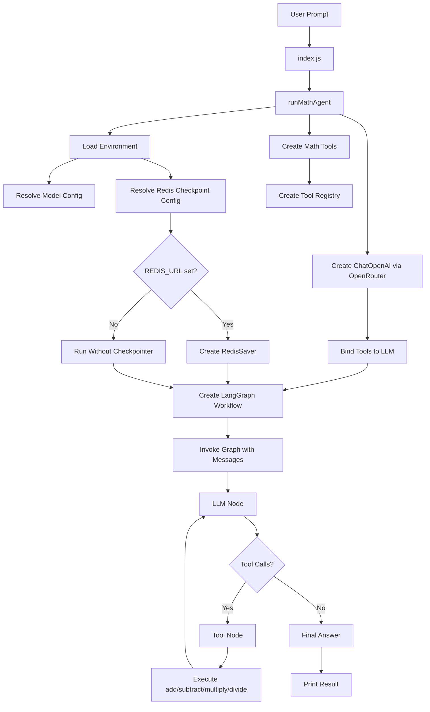
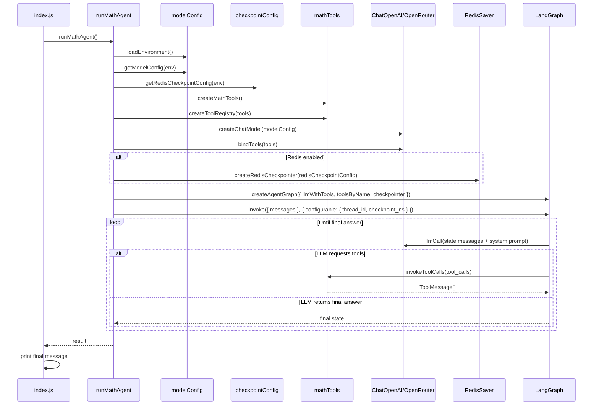

# langgraph-test

`langgraph-test` is a small LangGraph-based math agent built in Node.js. It uses an OpenRouter-backed chat model, exposes arithmetic tools to the model, and lets LangGraph orchestrate the loop between LLM reasoning and tool execution until a final answer is produced.

The project now also supports optional Redis-backed checkpointing, which means a LangGraph thread can persist its state outside process memory when `REDIS_URL` is configured.

## What This Project Does

- Accepts a natural-language math prompt as the initial user message.
- Uses a chat model through OpenRouter to interpret the request.
- Gives the model access to arithmetic tools: `add`, `subtract`, `multiply`, and `divide`.
- Runs a LangGraph workflow that decides whether to call tools or finish with a final answer.
- Optionally persists graph checkpoints in Redis using `@langchain/langgraph-checkpoint-redis`.

## What Is Done In This Project

This project is already structured into small focused modules, and each module is responsible for one part of the complete flow.

### 1. Entrypoint

**File:** `index.js`

This file starts the application.

What it does:

- Calls `runMathAgent()`.
- Prints the resolved model name.
- Prints the Redis thread ID when Redis checkpointing is enabled.
- Prints the final assistant response.
- Exits with a non-zero status if something fails.

### 2. Application Orchestration

**File:** `src/app/runMathAgent.js`

This is the composition root of the project.

What it does:

- Loads environment variables once.
- Resolves model configuration from `process.env`.
- Resolves optional Redis checkpoint configuration.
- Creates the arithmetic tools.
- Builds a tool registry for fast lookup by tool name.
- Creates the OpenRouter-backed chat model.
- Binds tools to the LLM.
- Creates the Redis checkpointer when Redis is enabled.
- Builds the LangGraph workflow.
- Invokes the graph with the initial messages.
- Passes LangGraph `configurable.thread_id` and `checkpoint_ns` when Redis is enabled.
- Closes the Redis checkpointer connection after the run finishes.

### 3. Configuration

#### `src/config/constants.js`

This file contains fixed runtime constants:

- `SYSTEM_PROMPT`
- default OpenRouter model
- OpenRouter base URL
- OpenRouter headers

#### `src/config/modelConfig.js`

This file handles environment-backed model configuration.

What it does:

- Loads `.env` using `dotenv`.
- Ensures `OPENROUTER_API_KEY` exists.
- Resolves the model name from `OPENROUTER_MODEL`.
- Falls back to `openrouter/free` when a model is not explicitly set.

#### `src/config/checkpointConfig.js`

This file handles Redis checkpoint configuration.

What it does:

- Enables Redis checkpointing only when `REDIS_URL` is present.
- Normalizes `LANGGRAPH_THREAD_ID`.
- Normalizes `LANGGRAPH_CHECKPOINT_NAMESPACE`.
- Parses optional TTL and refresh-on-read settings.
- Fails fast if invalid values are provided for:
  - `REDIS_CHECKPOINT_TTL_MINUTES`
  - `REDIS_CHECKPOINT_REFRESH_ON_READ`

### 4. Redis Checkpointer Integration

**File:** `src/checkpoint/createRedisCheckpointer.js`

This file isolates Redis-specific LangGraph persistence logic.

What it does:

- Creates an official `RedisSaver` using `RedisSaver.fromUrl(...)`.
- Passes TTL settings only when they are defined.
- Builds the LangGraph invoke config:

```js
{
  configurable: {
    thread_id: "<thread-id>",
    checkpoint_ns: "<namespace>",
  },
}
```

- Returns `null` when Redis is not configured, so the app still runs without persistence.

### 5. LLM Setup

**File:** `src/llm/createChatModel.js`

This file creates the model client.

What it does:

- Creates a `ChatOpenAI` instance.
- Points it to OpenRouter using a custom base URL.
- Adds request headers required by the OpenRouter setup.
- Uses `temperature: 0` for deterministic behavior.

### 6. Tool Layer

**File:** `src/tools/mathTools.js`

This file defines the arithmetic tools available to the model.

What it does:

- Defines a shared `zod` schema for tool arguments.
- Creates four arithmetic tools:
  - `multiply`
  - `add`
  - `divide`
  - `subtract`
- Protects division by zero.
- Builds a tool registry object keyed by tool name.

### 7. LangGraph Workflow

**File:** `src/graph/createAgentGraph.js`

This file defines the graph itself.

What it does:

- Creates an `llmCall` node.
- Creates a `tools` node.
- Routes from `llmCall` to `tools` when the model requests tool calls.
- Routes from `llmCall` to `__end__` when no tools are needed.
- Routes from `tools` back to `llmCall` so the model can continue reasoning with tool outputs.
- Compiles the graph with an optional checkpointer.

## High-Level System Design

The system is a single-agent workflow with optional persistence.

### Main Components

- `CLI Entrypoint`
  - Starts execution and prints outputs.
- `Application Layer`
  - Wires together config, tools, model, graph, and checkpointing.
- `Configuration Layer`
  - Resolves OpenRouter and Redis settings from environment variables.
- `LLM Layer`
  - Sends prompts to OpenRouter through `ChatOpenAI`.
- `Tool Layer`
  - Executes arithmetic operations requested by the model.
- `Graph Layer`
  - Controls the loop between reasoning and tool execution.
- `Checkpoint Layer`
  - Persists graph state to Redis when enabled.

### High-Level Flow

1. `index.js` starts the app.
2. `runMathAgent()` loads environment variables.
3. Model config is resolved from `OPENROUTER_API_KEY` and `OPENROUTER_MODEL`.
4. Redis checkpoint config is resolved from `REDIS_URL` and related env vars.
5. Arithmetic tools and the tool registry are created.
6. The OpenRouter-backed LLM is created and bound to the tools.
7. A Redis checkpointer is created if Redis is enabled.
8. The LangGraph workflow is compiled.
9. The graph is invoked with the initial user message.
10. The LLM decides whether to call a tool.
11. If tool calls exist, the graph executes the requested arithmetic tools.
12. Tool outputs are returned to the LLM as `ToolMessage` values.
13. The loop continues until the model returns a final answer.
14. The final answer is printed by the entrypoint.
15. If Redis is enabled, checkpoints are stored per `thread_id`.

### System Diagram



### Sequence Diagram



## Directory Structure

```text
langgraph-test/
├── index.js
├── index.js.example
├── README.md
├── LLD.md
├── package.json
├── package-lock.json
└── src/
    ├── app/
    │   └── runMathAgent.js
    ├── checkpoint/
    │   └── createRedisCheckpointer.js
    ├── config/
    │   ├── checkpointConfig.js
    │   ├── constants.js
    │   └── modelConfig.js
    ├── graph/
    │   └── createAgentGraph.js
    ├── llm/
    │   └── createChatModel.js
    └── tools/
        └── mathTools.js
```

## Environment Variables

### Required

```bash
OPENROUTER_API_KEY=your_openrouter_api_key
```

### Optional

```bash
OPENROUTER_MODEL=openrouter/free
REDIS_URL=redis://localhost:6379
LANGGRAPH_THREAD_ID=math-agent-thread
LANGGRAPH_CHECKPOINT_NAMESPACE=math-agent
REDIS_CHECKPOINT_TTL_MINUTES=60
REDIS_CHECKPOINT_REFRESH_ON_READ=true
```

## Setup

Install dependencies:

```bash
npm install
```

## Run

Run the app:

```bash
npm start
```

## Expected Runtime Behavior

When the app runs:

- The user question is seeded from `createInitialMessages()`.
- The model can choose arithmetic tools when it needs exact computation.
- The graph loops until the final answer is produced.
- When Redis is enabled, LangGraph checkpoints are persisted under the configured thread.

## Dependencies Used

- `@langchain/core`
- `@langchain/langgraph`
- `@langchain/langgraph-checkpoint-redis`
- `@langchain/openai`
- `dotenv`
- `zod`

## Notes

- Redis checkpointing is optional.
- Without `REDIS_URL`, the workflow still runs normally.
- With `REDIS_URL`, the project uses Redis-backed persistence for the LangGraph thread.
- The Redis setup should support the requirements of `@langchain/langgraph-checkpoint-redis`.
